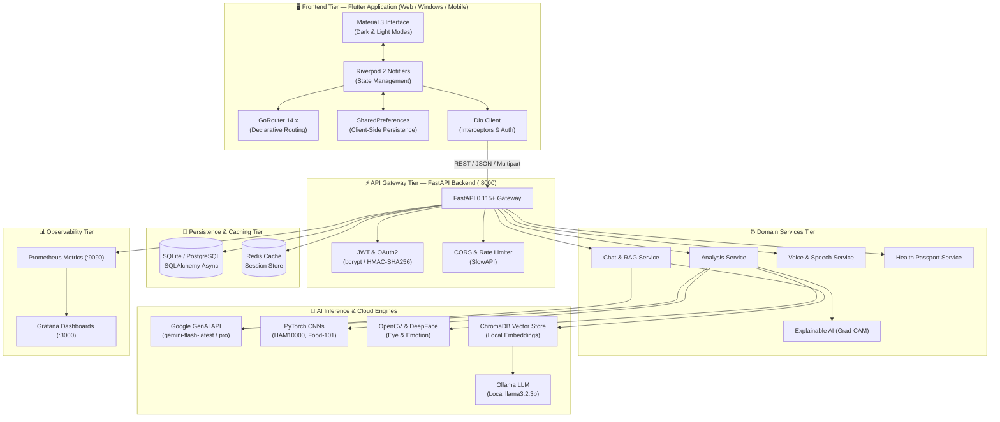

<div align="center">

# 🧠💚 AI WellnessVision
### *Next-Generation Multi-Modal AI Personal Health, Wellness & Clinical Vision Ecosystem*

[](https://flutter.dev)
[](https://fastapi.tiangolo.com)
[](https://ai.google.dev/)
[](https://pytorch.org/)
[](https://www.docker.com/)
[](https://kubernetes.io/)
[](https://prometheus.io/)
[](https://opensource.org/licenses/MIT)

<p align="center">
  <strong>AI WellnessVision</strong> is a privacy-first, enterprise-grade digital health ecosystem combining <strong>Deep Learning Computer Vision</strong>, <strong>Multimodal Generative AI (Google Gemini)</strong>, <strong>Explainable AI (Grad-CAM)</strong>, <strong>Real-time Voice Tele-interaction</strong>, and a <strong>Reactive Cross-Platform Flutter Interface</strong>.
</p>

[Key Features](#-key-features) • [System Architecture](#-system-architecture) • [Project Directory Structure](#-project-directory-structure) • [Quick Start Guide](#-quick-start-guide) • [API Documentation](#-api-endpoints-reference) • [DevOps & Cloud Deployment](#-devops-monitoring--cloud-deployment) • [Security & Compliance](#-security-privacy--compliance)

---

</div>

> [!WARNING]
> ### ⚠️ Clinical & Medical Advisory
> **AI WellnessVision** is engineered exclusively for preventative wellness tracking, educational guidance, and informational purposes. It is **not a certified diagnostic device (SaMD)** and must **not** be utilized as an alternative to professional clinical consultations, diagnostics, or medical therapy. High-risk symptoms are intercepted and routed to emergency response numbers.

---

## 🌟 Key Features

### 1. 🔬 Deep Learning Multimodal Vision Engine
* **Dermatology Screening (HAM10000)**: Custom `EfficientNet` classifier categorizing skin lesions with confidence scoring, paired with Google Gemini multimodal analysis.
* **Nutritional & Caloric Intelligence (Food-101)**: Computes macro-nutrient breakdowns (proteins, carbs, lipids) and caloric estimates from standard meal captures.
* **Ocular Fatigue & Redness Diagnostics**: Computes Eye Aspect Ratio (EAR) and conjunctival hyperemia via HSV segmentation for real-time digital eye strain assessment.
* **Facial Emotion & Stress Biomarkers**: Evaluates facial valence and micro-expressions via `DeepFace` and FER to calculate holistic wellness and stress indexes.

### 2. 🔍 Explainable AI (XAI) Transparency Layer
* **Grad-CAM Saliency Maps**: Generates visual heatmaps illustrating the exact image regions responsible for model classifications.
* **Evidence Attribution**: Demystifies black-box neural networks for both patients and healthcare reviewers before generating advice.

### 3. 🤖 Intelligent Health Copilot & RAG Engine
* **Multi-Turn Multimodal Chat**: Powered by Google GenAI (`gemini-flash-latest` with automated `gemini-pro-latest` fallback).
* **Local Knowledge Base (RAG)**: Offline semantic query engine leveraging **ChromaDB**, `sentence-transformers`, and local **Ollama (`llama3.2:3b`)**.
* **Emergency Life-Safety Interceptor**: Automatically detects critical clinical red-flags (e.g. acute coronary symptoms, self-harm) and overrides conversational flow to provide instant emergency hotline assistance (108 / 112 / 911).

### 4. 🎙️ Hands-Free Voice Tele-Consultant
* **Bi-Directional Voice Engine**: Low-latency Speech-to-Text (STT) and dynamic Text-to-Speech (TTS) synthesis.
* **Customizable Acoustics**: Adjustable speech rate, vocal pitch, and regional multi-language translation.

### 5. 🪪 Digital Health Passport & Dependents
* **Unified Health Identity**: Exportable digital health passport containing allergies, active prescriptions, blood types, and vitals history.
* **Family & Dependent Management**: Single-tenant administration of family members, elderly dependents, and children with historical wellness records.
* **PDF & QR Code Generation**: Portable records for rapid hospital intake or personal backup.

### 6. 🌓 Premium Cross-Platform Flutter Client
* **Modern Material 3 Theme**: Polished dark and light modes with custom color palettes and smooth animations.
* **Full Persistence**: All settings (theme, notification channels, speech rate, language, analytics) persist across reboots via `SharedPreferences`.
* **Robust State Architecture**: Powered by Riverpod 2 code generation (`@riverpod`) and GoRouter declarative routing.

---

## 🏛️ System Architecture



---

## 📂 Project Directory Structure

```text
ai-wellnessvision/
├── .env                              # Active environment configuration & API keys
├── .venv/                            # Isolated Python virtual environment
├── start_all.bat                     # 🚀 One-click full-stack orchestrator
├── run_backend.bat                   # ⚡ One-click FastAPI server launcher
├── run_app.bat                       # 📱 One-click Flutter client launcher
├── requirements_api.txt              # Production API dependencies
├── requirements.txt                  # Full ML & deep learning dependencies
├── Dockerfile                        # Multi-stage production container build
├── docker-compose.yml                # Multi-service stack (App, Postgres, Redis, Prometheus)
│
├── src/                              # 🐍 Backend Source Code (Python FastAPI)
│   ├── ai_models/                    # Deep learning models & vision analyzers
│   │   ├── cnn_health_analyzer.py    # Unified CNN inference pipeline
│   │   ├── skin_classifier.py        # HAM10000 skin lesion detection
│   │   ├── food_analyzer.py          # Food-101 nutrition & calorie classifier
│   │   ├── eye_health_analyzer.py    # OpenCV EAR & redness detector
│   │   ├── emotion_analyzer.py       # DeepFace & FER facial emotion analysis
│   │   └── visual_qa_system.py       # Visual Question-Answering engine
│   ├── api/                          # FastAPI routing, middleware, dependencies
│   │   ├── main.py                   # Application factory, lifespan & CORS
│   │   ├── dependencies.py           # Dependency injection (Auth, Repos, DB)
│   │   └── routers/                  # API resource endpoints
│   │       ├── analysis.py           # Vision analysis & history endpoints
│   │       ├── auth.py               # Authentication (login, register, me)
│   │       ├── chat.py               # Chat sessions, messages, WebSockets
│   │       ├── family.py             # Dependents & family profiles
│   │       ├── health_passport.py    # Digital health passport & vitals
│   │       ├── visual_qa.py          # Visual question answering
│   │       └── voice.py              # Text-to-speech & speech recognition
│   ├── database/                     # Persistence layer
│   │   ├── models.py                 # SQLAlchemy 2.0 async ORM models
│   │   ├── session.py                # Async engine & sessionmaker factory
│   │   ├── postgres_auth.py          # PostgreSQL connection manager
│   │   └── repositories/             # Data access repository pattern
│   ├── services/                     # Business logic & AI orchestration
│   │   ├── analysis_service.py       # Vision models + Gemini fallback
│   │   ├── chat_service.py           # GenAI health chat + safety interceptor
│   │   ├── explainable_ai_service.py # Grad-CAM saliency heatmaps
│   │   ├── nlp_service.py            # Local NLP & tokenization
│   │   ├── rag_health_service.py     # ChromaDB RAG vector search
│   │   └── speech_service.py         # Voice TTS & STT processing
│   ├── models/                       # Pydantic schemas & DTOs
│   │   └── api_schemas.py            # Request/Response validation models
│   └── monitoring/                   # Observability & telemetry
│       └── metrics.py                # Prometheus counters, histograms & gauges
│
├── flutter_app/                      # 💙 Frontend Client Application (Flutter)
│   ├── pubspec.yaml                  # Flutter package manifest & assets
│   ├── lib/
│   │   ├── main.dart                 # Application root & Riverpod initialization
│   │   ├── core/                     # Foundational infrastructure
│   │   │   ├── config/               # API base URL & platform detection
│   │   │   ├── constants/            # App styles, spacing & color palettes
│   │   │   ├── network/              # Dio client & token interceptors
│   │   │   ├── router/               # GoRouter declarative route tree
│   │   │   └── theme/                # Material 3 light/dark theme definitions
│   │   └── features/                 # Modular feature domains
│   │       ├── auth/                 # Login, Register & Session management
│   │       ├── chat/                 # AI Chat Copilot with typing bubbles
│   │       ├── family/               # Family & dependent profile management
│   │       ├── health_passport/      # Digital Health Passport & vitals view
│   │       ├── history/              # Historical analysis & chat sessions
│   │       ├── home/                 # Dynamic wellness dashboard & metrics
│   │       ├── image_analysis/       # Camera capture, gallery upload & results
│   │       ├── profile/              # User profile & statistics
│   │       ├── settings/             # Persistent settings (dark mode, speech)
│   │       └── voice/                # Voice interaction & listening screen
│   └── test/                         # Widget & unit test suite
│
├── monitoring/                       # 📈 Observability Configuration
│   ├── prometheus.yml                # Prometheus scrape targets
│   └── alert_rules.yml               # Production latency & error alert rules
│
└── k8s/                              # ☸️ Kubernetes Production Manifests
    ├── namespace.yaml                # Isolated namespace definition
    ├── ai-wellness-app.yaml          # Deployment & Service specifications
    ├── hpa.yaml                      # Horizontal Pod Autoscaler (CPU/RAM)
    ├── network-policies.yaml         # Ingress/Egress security policies
    ├── persistent-volumes.yaml       # Volume claims for uploads & models
    ├── postgres.yaml                 # StatefulSet for PostgreSQL
    └── redis.yaml                    # StatefulSet for Redis
```

---

## 🚀 Quick Start Guide

### 📋 Prerequisites
* **Python**: 3.10 or 3.11 installed
* **Flutter**: 3.35.x or later ([Download Flutter](https://flutter.dev/docs/get-started/install))
* **Browser / Device**: Google Chrome (for rapid web testing) or Windows Desktop build tools

---

### Option 1: One-Click Full Stack Launch (Fastest)

Simply double-click the root batch script:
```cmd
start_all.bat
```
*✨ This automatically spawns the FastAPI server in a dedicated console, waits for `/health` readiness, and launches the Flutter application in Google Chrome.*

---

### Option 2: Step-by-Step Manual Execution

#### Step A — Launch Backend API
```bash
# 1. Open Terminal in project root
cd d:\ai-wellnessvision

# 2. Activate Python environment
.venv\Scripts\activate

# 3. Ensure dependencies are satisfied
pip install -r requirements_api.txt

# 4. Launch FastAPI server
python -m uvicorn src.api.main:app --host 127.0.0.1 --port 8000 --reload
```
* **API Gateway**: `http://127.0.0.1:8000`
* **Health Check**: `http://127.0.0.1:8000/health`
* **Swagger Documentation**: `http://127.0.0.1:8000/docs`
* **ReDoc Documentation**: `http://127.0.0.1:8000/redoc`

#### Step B — Launch Flutter Application
```bash
# 1. Open a second Terminal
cd d:\ai-wellnessvision\flutter_app

# 2. Install Flutter packages
flutter pub get

# 3. Run on Chrome (Web)
flutter run -d chrome

# (Optional) Run on Windows Desktop
flutter run -d windows
```

---

## 📡 API Endpoints Reference

| Module | Method | Endpoint | Description | Auth Required |
|---|---|---|---|:---:|
| **System** | `GET` | `/health` | Service health, DB connectivity, uptime | No |
| **System** | `GET` | `/metrics` | Prometheus telemetry & model inference latencies | No |
| **Auth** | `POST` | `/api/v1/auth/register` | Register new account & return JWT bearer pair | No |
| **Auth** | `POST` | `/api/v1/auth/login` | Authenticate with credentials | No |
| **Auth** | `POST` | `/api/v1/auth/refresh` | Refresh expired access tokens | No |
| **Auth** | `GET` | `/api/v1/auth/me` | Fetch active user profile and preferences | Yes |
| **Chat** | `POST` | `/api/v1/chat/conversations` | Initialize a new conversational session | Optional |
| **Chat** | `GET` | `/api/v1/chat/conversations` | Retrieve all user conversation histories | Optional |
| **Chat** | `POST` | `/api/v1/chat/message` | Send message and receive AI health response | Optional |
| **Chat** | `WS` | `/api/v1/chat/ws/{id}` | WebSocket channel for real-time streaming chat | Optional |
| **Vision** | `POST` | `/api/v1/analysis/image` | Upload image for skin/food/eye/emotion scan | Optional |
| **Vision** | `GET` | `/api/v1/analysis/history` | Retrieve historical analysis scans & reports | Optional |
| **Family** | `POST` | `/api/v1/family` | Add dependent or family member profile | Yes |
| **Family** | `GET` | `/api/v1/family` | List all family profiles and records | Yes |
| **Passport** | `GET` | `/api/v1/health-passport` | Generate digital health passport JSON | Yes |
| **Passport** | `GET` | `/api/v1/health-passport/pdf` | Download formatted clinical PDF passport | Yes |
| **Voice** | `POST` | `/api/v1/voice/synthesize` | Convert clinical advice text to audio stream | No |

---

## 🐳 DevOps, Monitoring & Cloud Deployment

### 1. Multi-Container Orchestration (Docker Compose)
Launch the complete stack (FastAPI, PostgreSQL 15, Redis 7, Prometheus, and Grafana) with a single command:
```bash
docker-compose up -d
```
* **API Service**: `http://localhost:8000`
* **Prometheus Metrics**: `http://localhost:9090`
* **Grafana Dashboards**: `http://localhost:3000` *(Default: admin/admin)*

### 2. Kubernetes Cluster Deployment (Production)
Zero-downtime, autoscaling deployment via native Kubernetes manifests:
```bash
# 1. Create dedicated namespace
kubectl apply -f k8s/namespace.yaml

# 2. Deploy secrets, configs, volumes & databases
kubectl apply -f k8s/secrets.yaml
kubectl apply -f k8s/configmap.yaml
kubectl apply -f k8s/persistent-volumes.yaml
kubectl apply -f k8s/postgres.yaml
kubectl apply -f k8s/redis.yaml

# 3. Deploy API application & auto-scalers
kubectl apply -f k8s/ai-wellness-app.yaml
kubectl apply -f k8s/hpa.yaml
kubectl apply -f k8s/network-policies.yaml
```

---

## 🔒 Security, Privacy & Compliance

* **Privacy by Design**: All visual inference can operate completely offline via local models, preventing sensitive biometric data transmission.
* **Cryptographic Security**: Passwords hashed using `bcrypt`. Authentication tokens are signed with HMAC-SHA256 JWTs with configurable expiration cycles.
* **Defensive Input Sanitization**: Strict Pydantic schema validation protects against malformed payloads, SQL injection, and path traversal exploits.
* **Rate Limiting**: Integrated `SlowAPI` middleware limits request frequency to mitigate brute-force and DDoS vectors.

---

## 🧪 Verification & Code Quality

Both backend and frontend are strictly verified and tested:

```bash
# 1. Flutter Code Quality & Linter
cd flutter_app
flutter analyze     # 0 errors, 0 warnings ✅

# 2. Flutter Unit & Widget Tests
flutter test        # All tests passed ✅

# 3. Backend Unit & Integration Tests
cd ..
pytest tests/ -v
```

---

## 🤝 Contributing

Contributions to improve diagnostic accuracy, extend language models, or enhance UI accessibility are welcome!

1. **Fork** the repository
2. **Create** your feature branch: `git checkout -b feature/clinical-insight`
3. **Validate** changes: Run `flutter analyze` and `pytest`
4. **Commit** your work: `git commit -m 'feat: introduce hydration tracking indicator'`
5. **Push** to the branch: `git push origin feature/clinical-insight`
6. **Submit** a Pull Request

---

## 📄 License

This software is released under the **[MIT License](LICENSE)**.
<br>
<sub>© 2026 AI WellnessVision Contributors. Engineered for holistic, privacy-first preventative healthcare.</sub>